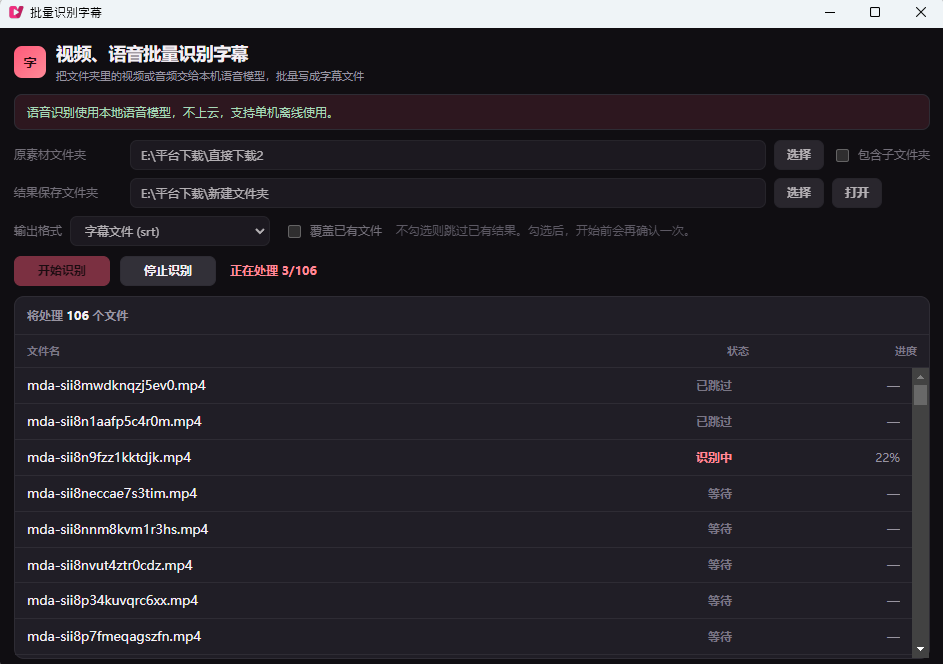

# 批量识别字幕

把一整个文件夹的视频和音频，交给 PixiuCut 已下载的本机语音模型，批量写成字幕文件。

口播、课程、素材库不用再一条条打开剪辑器。识别在本机完成，不上云，不占用正式版云端额度，也不会读取设置里的 API Key。模型就绪之后，断网也可以跑。



## 适合做什么

- 一次处理整个文件夹，也可以包含子文件夹
- 导出 **SRT** 字幕、**TXT** 文稿，或两种一起要
- 字幕按句断开，断句规则与剪辑器里的本机识别相同
- 子目录里的同名文件按相对路径分开保存，不会互相覆盖
- 默认识别过的文件会跳过；需要重做时再勾选覆盖，开始前会确认一次
- 中途可以停止。已经写好的字幕会留下，下次继续时默认接着未完成的部分

拖入文件夹即可设置路径。拖入的是文件时，会使用它所在的目录。

## 使用前

| | |
|---|---|
| 软件 | PixiuCut 桌面版 |
| 系统 | Windows |
| 模型 | 在 PixiuCut **设置**中下载本机语音模型 |

试用、未激活和正式版都可以用，只要本机模型已经下载。插件不能代替你下载模型。还没下载时，打开插件会提示去设置里下载。

同一时间只识别一条。剪辑器里的智能识别如果正在进行，请等它结束后再开始本插件。

## 安装

1. 下载本仓库的 zip，或自行把插件目录打成 zip。
2. 解压后，根目录上应直接看到 `manifest.json`，不要多包一层文件夹。
3. 打开 PixiuCut → 插件管理 → **从 zip 安装**。

安装后，首页快捷栏会出现 **批量识别字幕**。

安装时会请求这些权限：读取你选中的文件夹、把字幕写到保存目录、查看素材信息、使用本机语音识别。插件不连剪辑引擎，也不读取设置中的密钥。

## 怎么用

1. 选择或拖入原素材文件夹。需要连同下级目录一起处理时，勾选 **包含子文件夹**。
2. 选择或拖入结果保存文件夹。它可以和原素材文件夹相同，字幕会写在素材旁边。
3. 选择输出格式：字幕文件 (srt)、纯文本 (txt)，或同时输出。
4. 点 **开始识别**。列表里能看到每一条的状态和进度。

没有识别到人声的文件不会写出空字幕。图片和其他无法作为音视频读取的文件不会进入列表。

支持的常见格式：

- 视频：mp4、mov、mkv、avi、wmv、webm、m4v、flv、ts、m2ts、mpeg、mpg
- 音频：mp3、wav、aac、m4a、flac、ogg、wma、opus

文件能不能读，以 PixiuCut 实际探测到的结果为准。

## 结果长什么样

SRT 的时间和文本来自本机识别，插件不会再改时间、也不会把长句重新拆开。TXT 是每句一行，不带时间轴。

例如源目录是 `D:\素材`，保存目录是 `D:\字幕`：

```
D:\素材\口播.mp4        →  D:\字幕\口播.srt
D:\素材\甲\口播.mp4     →  D:\字幕\甲\口播.srt
D:\素材\乙\口播.mp4     →  D:\字幕\乙\口播.srt
```

## 开发

逻辑在 `assets/plan.js`。修改后可在本目录运行：

```bash
node --test assets/plan.test.js
```

页面不自带 SDK。在 PixiuCut 里打开插件时，由应用注入。

## 许可

[MIT](LICENSE)
